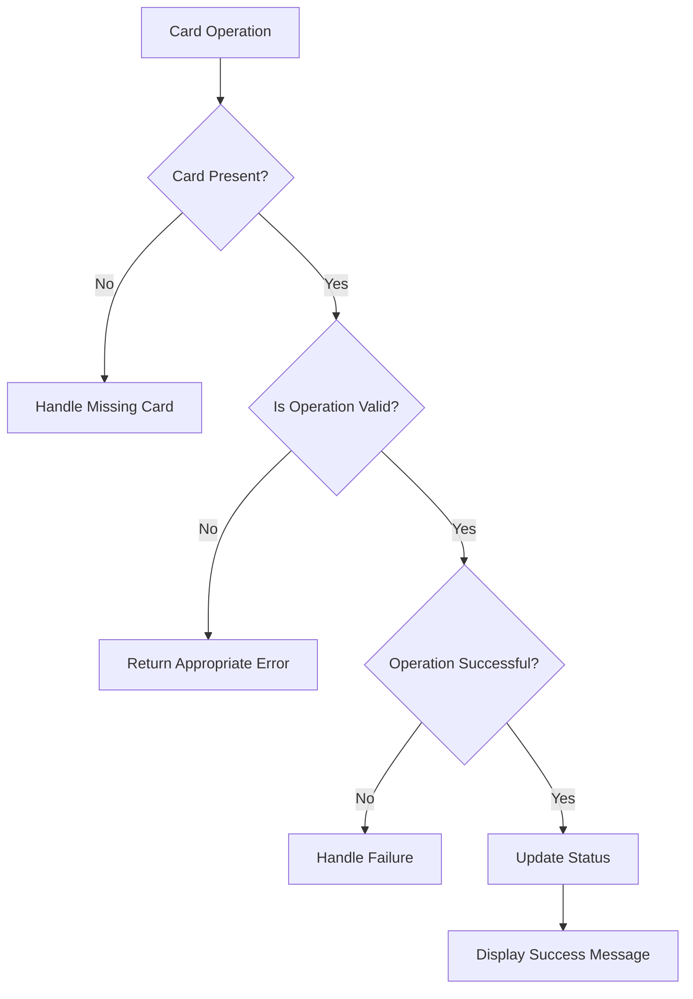
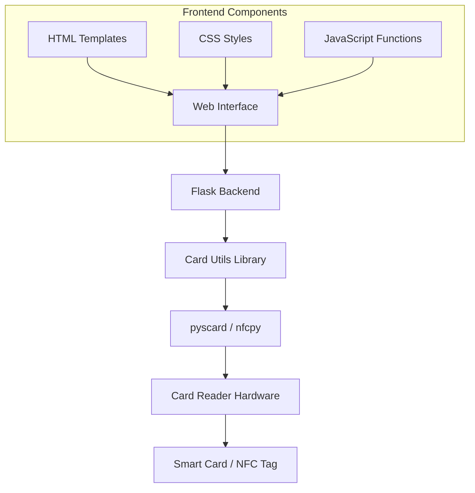

# Lifecycle Management of Smart Cards, NFC Tags, and RFID Tags

The management of smart cards, NFC (Near Field Communication) tags, and RFID (Radio Frequency Identification) tags encompasses several stages, from initial creation to deactivation. Understanding these stages is crucial for effective deployment and maintenance.

## Lifecycle Stages

1. **Design and Manufacturing**: This initial phase involves creating the physical hardware and embedding the necessary integrated circuits (ICs) or chips. For RFID and NFC tags, antennas are also incorporated to facilitate communication.
2. **Personalization**: At this stage, unique data is written onto the card or tag, such as identification numbers or security credentials, tailoring it for specific applications.
3. **Distribution**: The personalized cards or tags are then distributed to end-users or integrated into products, ready for deployment.
4. **Activation**: Upon issuance, the card or tag is activated within the system, enabling its intended functionalities.
5. **Usage**: During this phase, the card or tag operates within its designated application, such as access control, payment systems, or inventory tracking.
6. **Maintenance**: Regular updates or reconfigurations may be necessary to ensure optimal performance and security compliance.
7. **Deactivation**: When the card or tag is no longer needed or has expired, it is deactivated to prevent unauthorized use.
8. **Disposal**: Finally, the card or tag is securely disposed of, ensuring that any sensitive data is irretrievably erased.

## Comprehensive List of Actions on Cards and Tags

Various operations can be performed on smart cards, NFC tags, and RFID tags throughout their lifecycle:

| Operation | Description | System Function |
|-----------|-------------|----------------|
| **Connection** | Establishing communication with the card or tag | `connectCard()` |
| **Registration** | Incorporating the card or tag into a management system | `registerCard()` |
| **Verification** | Confirming the registration status | `checkRegistration()` |
| **Unregistration** | Removing the card from the management system | `unregisterCard()` |
| **Activation** | Enabling a card within the system | `activateCard()` |
| **Deactivation** | Temporarily disabling the card or tag | `deactivateCard()` |
| **Blocking** | Restricting access to the card, rendering it unusable | `blockCard()` |
| **Unblocking** | Restoring access to a blocked card | `unblockCard()` |
| **Memory Operations** | Reading from or writing to card memory | `readMemory()`, `writeMemory()` |
| **PIN Management** | Verifying or changing security credentials | `verifyPin()`, `changePin()` |
| **Backup** | Saving the current state or data for recovery | `backupCard()` |
| **Restoration** | Reinstating the card to a previous state | `restoreBackup()` |
| **Disposal** | Securely erasing all data from the card | `disposeCard()` |
| **Compatibility Check** | Verifying device compatibility | `checkCardCompatibility()` |
| **Recovery Mode** | Special mode for recovering damaged cards | `toggleRecoveryMode()` |

## Edge Cases and Error Handling

Common edge cases when working with smart cards include:

- **Deactivation of Inactive Card**: System verifies state first and returns "Already deactivated" message
- **Blocking Already Locked Card**: System checks lock status and skips operation if already locked
- **PIN Attempts Exceeded**: System tracks attempts and blocks card after limit is reached
- **Card Removal During Operation**: System detects removal and prompts for reinsertion
- **Backup Data Corruption**: System validates backup integrity via checksum before restoration

## Compatible Cards and Tags for Cherry SmartTerminal ST and ACR122U Devices

Both the Cherry SmartTerminal ST and the ACR122U NFC reader are designed to support a variety of smart cards and tags:

- **ISO 14443 Type A & B Cards**: These are standard contactless smart cards widely used in various applications.
- **MIFARE® Cards**: A popular series of contactless cards used in public transportation and access control.
- **FeliCa Cards**: Commonly used in Japan for electronic payment systems and transit applications.
- **NFC Tags (Types 1-4)**: Standardized NFC tags used for diverse applications, including information sharing and device pairing.

## System Architecture

## Python Libraries for Smart Card and NFC/RFID Interaction

To interface with smart cards and NFC/RFID tags using Python, several libraries are available:

- **pyscard**: A Python module that provides access to smart cards using the PC/SC API.
- **nfcpy**: A Python library for near field communication (NFC), enabling reading and writing of NFC tags.
- **PyNFC**: A Python wrapper for libnfc, facilitating communication with NFC devices.

## User Interface Components

The application provides a comprehensive interface for card management:

- **Connection Management**: Reader selection and card connection functions
- **Status Display**: Real-time card status monitoring with visual indicators
- **Basic Operations**: Reading and writing memory, PIN verification
- **Lifecycle Management**: Registration, activation/deactivation, blocking/unblocking
- **Security Operations**: PIN management, card locking
- **Advanced Functions**: Backup/restore, compatibility checking, recovery mode

## Implementation Best Practices

1. **Robust Error Handling**: Implement try-except blocks for all card operations
2. **User Feedback**: Provide clear status messages for all operations
3. **Confirmation for Critical Actions**: Require confirmation for destructive operations
4. **Status Updates**: Use real-time status indicators to show card state
5. **Dynamic Timeouts**: Adjust timeouts based on operation complexity
6. **Security Validation**: Verify permissions before executing sensitive operations

By following these guidelines, developers can create robust applications that effectively manage and interact with smart cards, NFC tags, and RFID tags throughout their complete lifecycle.
